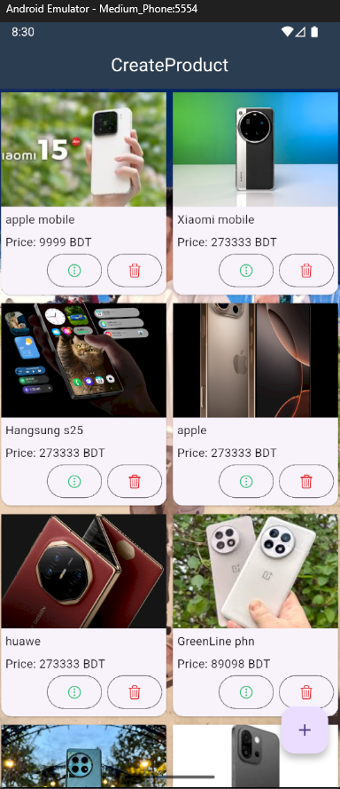

# CRUD Product App (Flutter)

A Flutter application to manage products (Create, Read, Update, Delete) using REST API from [Team Rabbil](https://crud.teamrabbil.com).

---

## 📱 App Preview


---

## ✨ Features
- 📋 View all products in a beautiful grid layout
- ➕ Add new products with details (name, code, image, prices, quantity)
- ✏️ Update product information
- ❌ Delete product with confirmation
- 🔄 Pull-to-refresh product list
- ✅ Success and error toast notifications

---

## 🛠️ Tech Stack
- **Flutter** (Dart)
- **REST API Integration** (HTTP package)
- **Team Rabbil CRUD API**
- **Material Design UI**

---

## 🚀 Getting Started

### 1️⃣ Clone the repository
```bash
git clone https://github.com/salauddin-R/CRUD-Product-App.git
cd <repo-name>

